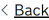
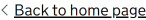
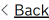

# Back link

[GDS Back link component](https://design-system.service.gov.uk/components/back-link/)

## Example - default content

```razor
<govuk-back-link href="/" />
```



## Example - custom content

```razor
<govuk-back-link href="/">Back to home page</govuk-back-link>
```



## Example - generated URL

```razor
<govuk-back-link asp-controller="Home" asp-action="Index" />
```



## API

### `<govuk-back-link>`

Content is the HTML to use within the back link component. Defaults to "Back".

| Attribute | Type | Description |
| --- | --- | --- |
| `href` | `string` | The URL that the hyperlink points to. |
| asp-* | `string` | TODO |