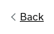
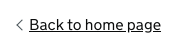

# Back link

[GDS Back link component](https://design-system.service.gov.uk/components/back-link/)

## Example - default content

```razor
<govuk-back-link href="/" />
```



## Example - custom content

```razor
<govuk-back-link href="/">Back to home page</govuk-back-link>
```



## Example - generated URL

```razor
<govuk-back-link asp-controller="Home" asp-action="Index" />
```

## API

### `<govuk-back-link>`

Content is the inner HTML to use within the generated `<a>`. Defaults to "Back".

| Attribute | Type | Description |
| --- | --- | --- |
| (link attributes) | | If specified generates an `href` attribute using the specified values. See [documentation on links](../links.md) for more information. |
| * | | Any additional attributes will be copied onto the generated `<a>`. |
