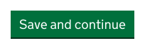
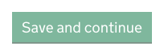

# Button

[GDS Button component](https://design-system.service.gov.uk/components/button/)

There are two tag helpers for the button component. `<govuk-button>` generates a `<button>` element; `<govuk-button-link>` generates an 'a' element.

## Example - default button

```razor
<govuk-button type="submit">Save and continue</govuk-button>
```



## Example - secondary button

```razor
<govuk-button class="govuk-button--secondary">Cancel</govuk-button>
```


## Example - start button

```razor
<govuk-button-link is-start-button="true" href="/start">Start</govuk-button>
```


## Example - disabled

```razor
<govuk-button disabled="true">Save and continue</govuk-button>
```



## Example - link

```razor
<govuk-button-link href="/">Confirm</govuk-button>
```

## Example - generated link

```razor
<govuk-button-link asp-controller="Home" asp-action="Confirm">Confirm</govuk-button>
```

## Example - generated formaction

```razor
<govuk-button type="submit" asp-controller="Home" asp-action="Confirm">Confirm</govuk-button>
```

## API

### `<govuk-button>`

The content is the HTML to use within the generated button.

| Attribute | Type | Description |
| --- | --- | --- |
| `disabled` | `bool` | Whether the button should be disabled. The default is `false`. |
| `is-start-button` | `bool` | Whether this button is the main call to action on your service's start page. The default is `false`. |
| `prevent-double-click` | `bool` | Whether to prevent accidental double clicks on submit buttons from submitting forms multiple times. The default is `false` but can be configured globally by setting the `DefaultButtonPreventDoubleClick` property on `GovUkFrontendAspNetCoreOptions`. |
| (link attributes) | | If specified generates a `formaction` attribute using the specified values. See [documentation on links](../links.md) for more information. |

### `<govuk-button-link>`

The content is the HTML to use within the generated link.

| Attribute | Type | Description |
| --- | --- | --- |
| `disabled` | `bool` | Whether the button should be disabled. The default is `false`. |
| `is-start-button` | `bool` | Whether this button is the main call to action on your service's start page. The default is `false`. |
| (link attributes) | | If specified generates an `href` attribute using the specified values. See [documentation on links](../links.md) for more information. |
