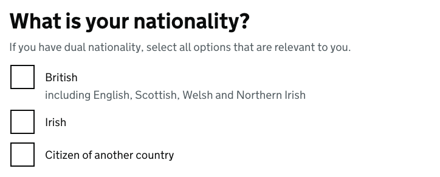
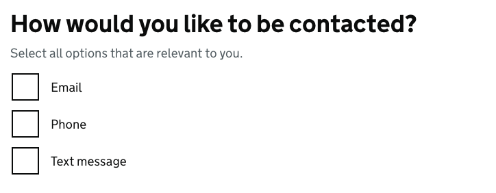
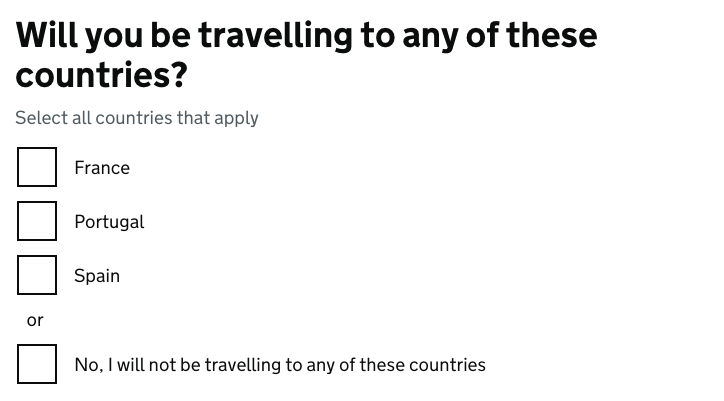
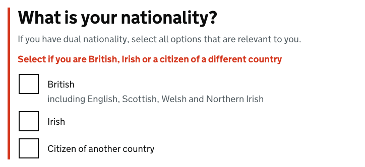

# Checkboxes

[GDS Checkboxes component](https://design-system.service.gov.uk/components/checkboxes/)

## Example

```razor
<govuk-checkboxes name="nationality">
    <govuk-checkboxes-fieldset>
        <govuk-checkboxes-fieldset-legend is-page-heading="true" class="govuk-fieldset__legend--l">
            What is your nationality?
        </govuk-checkboxes-fieldset-legend>

        <govuk-checkboxes-hint>
            If you have dual nationality, select all options that are relevant to you.
        </govuk-checkboxes-hint>

        <govuk-checkboxes-item value="british">
            British
            <govuk-checkboxes-item-hint>including English, Scottish, Welsh and Northern Irish</govuk-checkboxes-item-hint>
        </govuk-checkboxes-item>
        <govuk-checkboxes-item value="irish">Irish</govuk-checkboxes-item>
        <govuk-checkboxes-item value="other">Citizen of another country</govuk-checkboxes-item>
    </govuk-checkboxes-fieldset>
</govuk-checkboxes>
```



## Example - without fieldset

```razor
<govuk-checkboxes name="t-and-c">
    <govuk-checkboxes-item value="yes">
        I agree to the terms and conditions
    </govuk-checkboxes-item>
</govuk-checkboxes>
```


## Example - with conditional reveal

```razor
<govuk-checkboxes name="contact">
    <govuk-checkboxes-fieldset>
        <govuk-checkboxes-fieldset-legend is-page-heading="true" class="govuk-fieldset__legend--l">
            How would you like to be contacted?
        </govuk-checkboxes-fieldset-legend>

        <govuk-checkboxes-hint>
            Select all options that are relevant to you.
        </govuk-checkboxes-hint>

        <govuk-checkboxes-item value="email">
            Email
            <govuk-checkboxes-item-conditional>
                <govuk-input name="contact-by-email" type="email" autocomplete="email" spellcheck="false" input-class="govuk-!-width-one-third">
                    <govuk-input-label>Email address</govuk-input-label>
                </govuk-input>
            </govuk-checkboxes-item-conditional>
        </govuk-checkboxes-item>

        <govuk-checkboxes-item value="phone">
            Phone
            <govuk-checkboxes-item-conditional>
                <govuk-input name="contact-by-phone" type="tel" autocomplete="tel" input-class="govuk-!-width-one-third">
                    <govuk-input-label>Phone number</govuk-input-label>
                </govuk-input>
            </govuk-checkboxes-item-conditional>
        </govuk-checkboxes-item>

        <govuk-checkboxes-item value="text message">
            Text message
            <govuk-checkboxes-item-conditional>
                <govuk-input name="contact-by-text" type="tel" autocomplete="tel" input-class="govuk-!-width-one-third">
                    <govuk-input-label>Mobile phone number</govuk-input-label>
                </govuk-input>
            </govuk-checkboxes-item-conditional>
        </govuk-checkboxes-item>
    </govuk-checkboxes-fieldset>
</govuk-checkboxes>
```



## Example - with 'none' option

```razor
<govuk-checkboxes name="countries">
    <govuk-checkboxes-fieldset>
        <govuk-checkboxes-fieldset-legend is-page-heading="true" class="govuk-fieldset__legend--l">
            Will you be travelling to any of these countries?
        </govuk-checkboxes-fieldset-legend>

        <govuk-checkboxes-hint>
            Select all countries that apply
        </govuk-checkboxes-hint>

        <govuk-checkboxes-item value="france">France</govuk-checkboxes-item>
        <govuk-checkboxes-item value="portugal">Portugal</govuk-checkboxes-item>
        <govuk-checkboxes-item value="spain">Spain</govuk-checkboxes-item>
        <govuk-checkboxes-divider>or</govuk-checkboxes-divider>
        <govuk-checkboxes-item value="none" behavior="Exclusive">No, I will not be travelling to any of these countries</govuk-checkboxes-item>
    </govuk-checkboxes-fieldset>
</govuk-checkboxes>
```



## Example - with error message

```razor
<govuk-checkboxes name="nationality">
    <govuk-checkboxes-fieldset>
        <govuk-checkboxes-fieldset-legend is-page-heading="true" class="govuk-fieldset__legend--l">
            What is your nationality?
        </govuk-checkboxes-fieldset-legend>

        <govuk-checkboxes-hint>
            If you have dual nationality, select all options that are relevant to you.
        </govuk-checkboxes-hint>

        <govuk-checkboxes-error-message>
            Select if you are British, Irish or a citizen of a different country
        </govuk-checkboxes-error-message>

        <govuk-checkboxes-item value="british">
            British
            <govuk-checkboxes-item-hint>including English, Scottish, Welsh and Northern Irish</govuk-checkboxes-item-hint>
        </govuk-checkboxes-item>
        <govuk-checkboxes-item value="irish">Irish</govuk-checkboxes-item>
        <govuk-checkboxes-item value="other">Citizen of another country</govuk-checkboxes-item>
    </govuk-checkboxes-fieldset>
</govuk-checkboxes>
```



## API

### `<govuk-checkboxes>`

| Attribute | Type | Description |
| --- | --- | --- |
| `asp-for` | `ModelExpression` | The model expression used to generate the `name` and `id` attributes as well as the `selected` attribute for items and error message content. See [documentation on forms](forms.md) for more information. |
| `checkboxes-*` | | Additional attributes to add to the generated container element that wraps the items. |
| `id-prefix` | `string` | The prefix to use when generating IDs for the hint, error message and items. If not specified then a value is generated from the `name` attribute. Required unless the `asp-for` attribute or `name` atribute is specified. |
| `ignore-modelstate-errors` | `bool` | Whether ModelState errors on the ModelExpression specified by the `asp-for` attribute should be ignored when generating an error message. The default is `false`. |
| `name` | `string` | The `name` attribute for the generated `input` element. Required unless the `asp-for` attribute or `id-prefix` attribute is specified. |

### `<govuk-checkboxes-fieldset>`

A container element used when checkboxes content should be contained with a `fieldset` element.
When used every `<govuk-checkboxes-hint>`, `<govuk-checkboxes-error-message>`, `<govuk-checkboxes-item>` and `<govuk-checkboxes-divider>` must be placed inside this element, not the root `<govuk-checkboxes>`.\
Must be inside a `<govuk-checkboxes>` element.

### `<govuk-checkboxes-fieldset-legend>`

*Required* when a `<govuk-checkboxes-fieldset>` is specified\
The content is the HTML to use within the legend.\
Must be inside a `<govuk-checkboxes-fieldset>` element.

| Attribute | Type | Description |
| --- | --- | --- |
| `is-page-heading` | `boolean` | Whether the legend also acts as the heading for the page. The default is `false`. |

### `<govuk-checkboxes-hint>`

The content is the HTML to use within the component's hint.\
Must be inside a `<govuk-checkboxes>` or `<govuk-checkboxes-fieldset>` element.

If the `asp-for` attribute is specified on the parent `<govuk-checkboxes>` then content for the hint will be generated from the model expression.\
If you want to retain the generated content and specify additional attributes then use a self-closing tag e.g.
`<govuk-checkboxes-hint class="some-additional-class" />`.

### `<govuk-checkboxes-error-message>`

The content is the HTML to use within the component's error message.\
Must be inside a `<govuk-checkboxes>` or `<govuk-checkboxes-fieldset>` element.

If the `asp-for` attribute is specified on the parent `<govuk-checkboxes>` then content for the error message will be generated from the model expression.
(To prevent this set `ignore-modelstate-errors` on the parent `<govuk-checkboxes>` to `false`.) Specifying any content here will override any generated error message.\
If you want to retain the generated content and specify additional attributes then use a self-closing tag e.g.
`<govuk-checkboxes-error-message visually-hidden-text="Error" />`.

| Attribute | Type | Description |
| --- | --- | --- |
| `visually-hidden-text` | `string` | The visually hidden prefix used before the error message. The default is `Error`. |

### `<govuk-checkboxes-item>`

The content is the HTML to use within the label for the generated `input` element.\
Must be inside a `<govuk-checkboxes>` or `<govuk-checkboxes-fieldset>` element.

| Attribute | Type | Description |
| --- | --- | --- |
| `checked` | `bool` | Whether the item should be checked. If this attribute is not specified but the `asp-for` attribute is specified on the parent `<govuk-checkboxes>` then this value will be computed by comparing the `value` attribute with the model value; if the `value` attribute matches the string representation of the model or the model is a collection and the collection contains an entry whose string representation matches the `value` attribute then `checked` will be inferred to `true`. |
| `disabled` | `bool` | Whether the item should be disabled. The default is `false`. |
| `id` | `string` | The `id` attribute for the generated `input` element. If not specified then a value is generated from the `name` attribute. |
| `input-*` | | Additional attributes to add to the generated `input` element. |
| `label-*` | | Additional attributes to add to the generated `label` element. |
| `name` | string | The `name` attribute for the generated `input` element. Required unless the `asp-for` attribute or `name` attribute is specified on the parent `<govuk-checkboxes>`. |
| `value` | `string` | *Required* The `value` attribute for the generated `input` element. |

### `<govuk-checkboxes-item-conditional>`

The content is the HTML to use within the conditional reveal for the item.\
Must be inside a `<govuk-checkboxes-item>`.

### `<govuk-checkboxes-divider>`

The content is the HTML to use within item divider.\
Must be inside a `<govuk-checkboxes>` or `<govuk-checkboxes-fieldset>` element.
