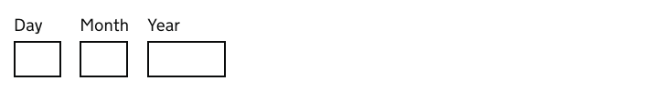
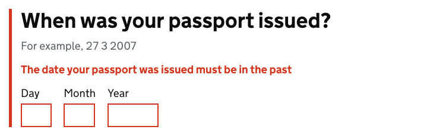
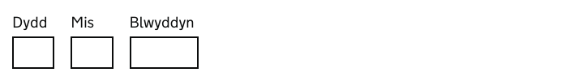
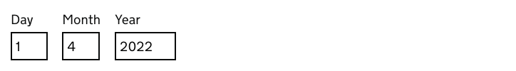

# Date input

[GDS Date input component](https://design-system.service.gov.uk/components/date-input/)

## Example

```razor
<govuk-date-input id="passport-issued" name-prefix="passport-issued" />
```



## Example - with model binding

```razor
@model MyModel

<govuk-date-input for="PassportIssueDate">
    <fieldset>
        <legend is-page-heading="true" class="govuk-fieldset__legend--l" />
    </fieldset>
</govuk-date-input>
```

```cs
public class MyModel
{
    [Display(Name = "When was your passport issued?")]
    [Required(ErrorMessage = "Enter your passport issue date")]
    [DateInput(ErrorMessagePrefix = "Your passport issue date")]
    public DateOnly? PassportIssueDate { get; set; }
}
```


## Example - with error message

```razor
<govuk-date-input id="passport-issued" name-prefix="passport-issued">
    <error-message>
        The date your passport was issued must be in the past
    </error-message>
</govuk-date-input>
```


## Example - with fieldset

```razor
<govuk-date-input id="passport-issued" name-prefix="passport-issued">
    <fieldset>
        <legend is-page-heading="true" class="govuk-fieldset__legend--l">
            When was your passport issued?
        </legend>
        <hint>
            For example, 27 3 2007
        </hint>
        <error-message>
            The date your passport was issued must be in the past
        </error-message>
    </fieldset>
</govuk-date-input>
```



## Example - with custom item labels

```razor
<govuk-date-input id="passport-issued" name-prefix="passport-issued">
    <day>
        <label>Dydd</label>
    </day>
    <month>
        <label>Mis</label>
    </month>
    <year>
        <label>Blwyddyn</label>
    </year>
</govuk-date-input>
```



## Example - with custom item values

```razor
<govuk-date-input id="passport-issued" name-prefix="passport-issued">
    <day value="1" />
    <month value="4" />
    <year value="2022" />
</govuk-date-input>
```




## API

### `<govuk-date-input>`

The content is the HTML to use within the generated component.

| Attribute | Type | Description |
| --- | --- | --- |
| `for` | `ModelExpression` | The model expression used to generate the `name-prefix`, `id` and `value` attributes as well as the error message content. The model type should be a `Date`, `DateTime` or a type that has a custom converter registered. See [custom date types](#custom-date-types) and [documentation on forms](forms.md) for more information. |
| `date-input-`*` | | Additional attributes for the container element that wraps the items. |
| `disabled` | `bool?` | Whether the inputs should be disabled. The default is `false`. |
| `id` | `string` | The `id` attribute for the main component. Required unless the `for` attribute is specified. |
| `ignore-modelstate-errors` | `bool?` | Whether ModelState errors on the ModelExpression specified by the `for` attribute should be ignored when generating an error message. |
| `name-prefix` | `string` | Optional prefix for the `name` attribute on each item's input. |
| `value` | `object` | The date to populate the item values with. The value should be a `Date`, `DateTime` or a type that has a custom converter registered. See [custom date types](#custom-date-types) for more information. |

### `<hint>`

The content is the HTML to use within the component's hint.\
Must be inside a `<govuk-date-input>` or `<fieldset>` element.

If the `for` attribute is specified on the parent `<govuk-date-input>` then content for the hint will be generated from the model expression.\
If you want to retain the generated content and specify additional attributes then use a self-closing tag e.g.
`<hint class="some-additional-class" />`.

### `<error-message>`

The content is the HTML to use within the component's error message.\
Must be inside a `<govuk-date-input>` or `<fieldset>` element.

If the `for` attribute is specified on the parent `<govuk-date-input>` then content for the error message will be generated from the model expression.
(To prevent this set `ignore-modelstate-errors` on the parent `<govuk-date-input>` to `false`.) Specifying any content here will override any generated error message.\
If you want to retain the generated content and specify additional attributes then use a self-closing tag e.g.
`<error-message visually-hidden-text="Error" />`.

| Attribute | Type | Description |
| --- | --- | --- |
| `error-items` | `DateInputErrorFields?` | The components of the date that have errors (day, month and/or year). By default this is resolved by looking up the errors that occurred on model binding. The fallback is `DateInputErrorComponents.All`. |
| `visually-hidden-text` | `string` | The visually hidden prefix used before the error message. The default is `Error`. |

### `<fieldset>`

A container element used when date input content should be contained with a `fieldset` element.
When used every other child elemenet must be placed inside this element, not the root `<govuk-date-input>`.\
Must be inside a `<govuk-date-input>` element.

### `<legend>`

*Required* when a `<fieldset>` is specified\
The content is the HTML to use within the legend.\
Must be inside a `<fieldset>` element.

| Attribute | Type | Description |
| --- | --- | --- |
| `is-page-heading` | `boolean` | Whether the legend also acts as the heading for the page. The default is `false`. |

### `<day>`, `<month>`, `<year>`

Must be inside a `<govuk-date-input>` or `<fieldset>` element.

| Attribute | Type | Description |
| --- | --- | --- |
| `autocomplete` | `string` | The `autocomplete` attribute for the generated `input` element. |
| `id` | `string` | The `id` attribute for the item's geneated `input` element. |
| `inputmode` | `string` | The `inputmode` attribute for the item's generated `input` element. The default is `numeric`. |
| `name` | `string` | The `name` attribute for the item's generated `input` element. |
| `pattern` | `string` | The `pattern` attribute for the item's generated `input` element. The default is `[0-9]*`. |
| `value` | `int?` | The `value` attribute for the item's generated `input` element. |

### `<label>`

Must be inside a `<day>`, `<month>`, or `<year>` element.

The content is the HTML to use within the item's label.


## Custom date types

By default `System.DateTime` and `GovUk.Frontend.AspNetCore.Date` instances can be used as values for this component. A model binder converts the three inputs into a single instance of whatever model type is required. The model binder also tracks which components were invalid so that the correct items can be highlighted and a useful error message can be provided.

You can add support for additional types by implementing `GovUk.Frontend.AspNetCore.DateInputModelConverter`. See the sample at `samples/DateInput/` for an example with NodaTime.
