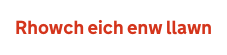

# Error message

[GDS Error message component](https://design-system.service.gov.uk/components/error-message/)

## Example - specified content

```razor
<govuk-error-message>Enter your full name</govuk-error-message>
```


## Example - overriden visually hidden text

```razor
<govuk-error-message visually-hidden-text="Gwall">Rhowch eich enw llawn</govuk-error-message>
```



## Example - ModelState error

```razor
<govuk-error-message asp-for="FullName" />
```


## API

### `<govuk-error-message>`

Content is the inner HTML to use within the generated `<span>`. Content is required if the `asp-for` attribute is not specified.

If `asp-for` is specified and there are no errors in `ModelState` then no output will be generated. If there are multiple errors only the first will be used.

| Attribute | Type | Description |
| --- | --- | --- |
| `asp-for` | `ModelExpression` | The model expression used to generate the error message. If content is specified this attribute is ignored. See [documentation on forms](../forms.md) for more information. |
| `visually-hidden-text` | `string` | A visually hidden prefix used before the error message. Defaults to `Error`. |
| * | | Any additional attributes will be copied onto the generated `<span>`. |
