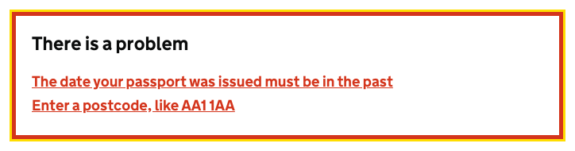

# Error summary

[GDS Error summary component](https://design-system.service.gov.uk/components/error-summary/)

> [!NOTE]
> By default an Error summary will be added to the top of your `<main>` element containing links to all the errors on the page.
You can disable this by setting the `GenerateErrorSummaries` property on `GovUkFrontendAspNetCoreOptions` to `GenerateErrorSummariesOptions.None`.

## Example

```razor
<govuk-error-summary>
    <govuk-error-summary-item href="#passport-issued-day">The date your passport was issued must be in the past</govuk-error-summary-item>
    <govuk-error-summary-item href="#postcode-input">Enter a postcode, like AA1 1AA</govuk-error-summary-item>
</govuk-error-summary>
```


## Example - overriden title

```razor
<govuk-error-summary>
    <govuk-error-summary-title>There is a problem</govuk-error-summary-title>
    <govuk-error-summary-item href="#passport-issued-day">The date your passport was issued must be in the past</govuk-error-summary-item>
    <govuk-error-summary-item href="#postcode-input">Enter a postcode, like AA1 1AA</govuk-error-summary-item>
</govuk-error-summary>
```



## Example - ModelState error

```razor
<govuk-error-summary>
    <govuk-error-summary-item for="FullName" />
</govuk-error-summary>
```


## API

### `<govuk-error-summary>`

| Attribute            | Type   | Description                                                                                                 |
|----------------------|--------|-------------------------------------------------------------------------------------------------------------|
| `disable-auto-focus` | `bool` | Whether to disable the behavior that focuses the error summary when the page loads. The default is `false`. |

### `<govuk-error-summary-title>`

The content is the HTML to use within the title for the error summary. If this element is not specified then the content is `There is a problem`.\
Must be inside a `<govuk-error-summary>` element.

### `<govuk-error-summary-description>`

The content is the HTML to use within the description for the error summary.\
Must be inside a `<govuk-error-summary>` element.

### `<govuk-error-summary-item>`

The content is the HTML to use within the error link item. Content is required if the `for` attribute is not specified.\

If `for` is specified and there are no errors in `ModelState` then the item will not be rendered.

Must be inside a `<govuk-error-summary>` element.

| Attribute         | Type              | Description                                                                                                                                                                 |
|-------------------|-------------------|-----------------------------------------------------------------------------------------------------------------------------------------------------------------------------|
| `for`             | `ModelExpression` | The model expression used to generate the error message. If content is specified this attribute is ignored. See [documentation on forms](../forms.md) for more information. |
| `link-*`          |                   | Additional attributes to add to the generated `a` element.                                                                                                                  |
| (link attributes) |                   | If specified generates an `href` attribute using the specified values. See [documentation on links](../links.md) for more information.                                      |
