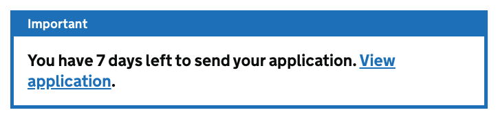
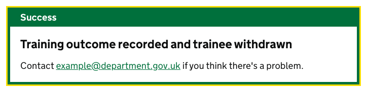
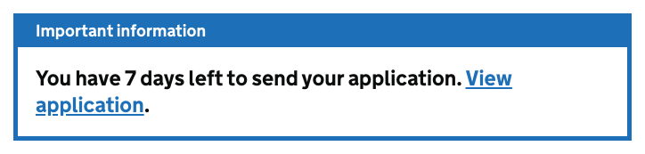

# Notification banner

[GDS Notification banner component](https://design-system.service.gov.uk/components/notification-banner/)

## Example

```razor
<govuk-notification-banner>
    <p class="govuk-notification-banner__heading">
        You have 7 days left to send your application.
        <a class="govuk-notification-banner__link" href="#">View application</a>.
    </p>
</govuk-notification-banner>
```



## Example - Success

```razor
<govuk-notification-banner type="Success">
    <p class="govuk-notification-banner__heading">
        Training outcome recorded and trainee withdrawn
    </p>
    <p class="govuk-body">Contact <a class="govuk-notification-banner__link" href="#">example@department.gov.uk</a> if you think there's a problem.</p>
</govuk-notification-banner>
```



## Example - overriden title

```razor
<govuk-notification-banner>
    <govuk-notification-banner-title heading-level="2" id="banner-title">
        Important information
    </govuk-notification-banner-title>
    <p class="govuk-notification-banner__heading">
        You have 7 days left to send your application.
        <a class="govuk-notification-banner__link" href="#">View application</a>.
    </p>
</govuk-notification-banner>
```



## API

### `<govuk-notification-banner>`

| Attribute | Type | Description |
| --- | --- | --- |
| `disable-auto-focus` | `bool` | Whether to disable the behavior that focuses the notification banner when the page loads. Only applies when `type` is `Success`. The default is `false`. |
| `role` | `string` | The `role` attribute for the notification banner. If `type` is `Success` then the default is `alert` otherwise `region`. |
| `type` | `GovUk.Frontend.AspNetCore.NotificationBannerType` | The type of notification. The default is `NotificationBannerType.Default`. |

The content is the HTML to use within the notification banner.

### `<govuk-notification-banner-title>`

| Attribute | Type | Description |
| --- | --- | --- |
| `heading-level` | `int` | The heading level for the notification banner title. Must be between `1` and `6` (inclusive). The default is `2`. |
| `id` | `string` | The `id` attribute for the notification banner title. The default is `govuk-notification-banner-title`. Cannot be `null` or empty. |

The content is the HTML to use within the notification banner's title. Use a self-closing tag to keep the default content.\
Must be inside a `<govuk-notification-banner>` element.
