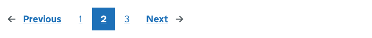
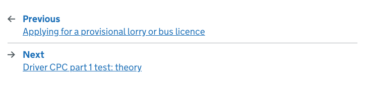
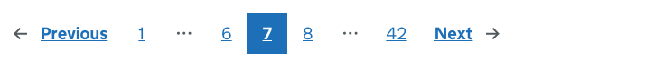

# Pagination

[GDS Pagination component](https://design-system.service.gov.uk/components/pagination/)

## Example

```razor
<govuk-pagination>
    <govuk-pagination-previous href="#" />
    <govuk-pagination-item href="#">1</govuk-pagination-item>
    <govuk-pagination-item href="#" is-current="true">2</govuk-pagination-item>
    <govuk-pagination-item href="#">3</govuk-pagination-item>
    <govuk-pagination-next href="#" />
</govuk-pagination>
```



## Example - stacked

```razor
<govuk-pagination>
    <govuk-pagination-previous href="#" label-text="Applying for a provisional lorry or bus licence" />
    <govuk-pagination-next href="#" label-text="Driver CPC part 1 test: theory" />
</govuk-pagination>
```



## Example - with ellipsis

```razor
<govuk-pagination>
    <govuk-pagination-previous href="#" />
    <govuk-pagination-item href="#">1</govuk-pagination-item>
    <govuk-pagination-ellipsis />
    <govuk-pagination-item href="#">6</govuk-pagination-item>
    <govuk-pagination-item href="#" is-current="true">7</govuk-pagination-item>
    <govuk-pagination-item href="#">8</govuk-pagination-item>
    <govuk-pagination-ellipsis />
    <govuk-pagination-item href="#">42</govuk-pagination-item>
    <govuk-pagination-next href="#" />
</govuk-pagination>
```



## API

### `<govuk-pagination>`

| Attribute | Type | Description |
| --- | --- | --- |
| `landmark-label` | `string` | The label for the navigation landmark that wraps the pagination. The default is `results`. |

### `<govuk-pagination-previous>`

| Attribute | Type | Description |
| --- | --- | --- |
| (link attributes) | | If specified generates an `href` attribute using the specified values. See [documentation on links](../links.md) for more information. |
| `label-text` | `string` | The optional label that goes underneath the link to the previous page, providing further context for the user about where the link goes. |
| `link-*` | | Additional attributes to add to the generated `<a>` element. |

The content is the text for the link to the previous page. The default is `Previous page`.\
Must be inside a `<govuk-pagination>` element.

### `<govuk-pagination-item>`

| Attribute | Type | Description |
| --- | --- | --- |
| (link attributes) | | If specified generates an `href` attribute using the specified values. See [documentation on links](../links.md) for more information. |
| `is-current` | `bool` | Whether this item is the current page the user is on. By default this is determined by comparing the current URL to this item's generated `href` attribute. |
| `visually-hidden-text` | `string` | The visually hidden text for the pagination item. The default is `Page <pagination item text>`. |

The content is the pagination item text - usually a page number.\
Must be inside a `<govuk-pagination>` element.

### `<govuk-pagination-ellipsis>`

Must be inside a `<govuk-pagination>` element.

### `<govuk-pagination-next>`

| Attribute | Type | Description |
| --- | --- | --- |
| (link attributes) | | If specified generates an `href` attribute using the specified values. See [documentation on links](../links.md) for more information. |
| `label-text` | `string` | The optional label that goes underneath the link to the next page, providing further context for the user about where the link goes. |
| `link-*` | | Additional attributes to add to the generated `<a>` element. |

The content is the text for the link to the next page. The default is `Next page`.\
Must be inside a `<govuk-pagination>` element.
