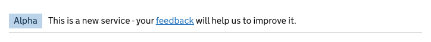

# Phase banner

[GDS Phase banner component](https://design-system.service.gov.uk/components/phase-banner/)

## Example

```razor
<govuk-phase-banner>
    <govuk-phase-banner-tag>Alpha</govuk-phase-banner-tag>
    This is a new service - your <a href="#" class="govuk-link">feedback</a> will help us to improve it.
</govuk-phase-banner>
```



## API

### `<govuk-phase-banner>`

The content is the HTML to use within the generated component.

### `<govuk-phase-banner-tag>`

*Required*\
The content is the HTML to use within the phase banner tag.\
Must be inside a `<govuk-phase-banner>` element.
