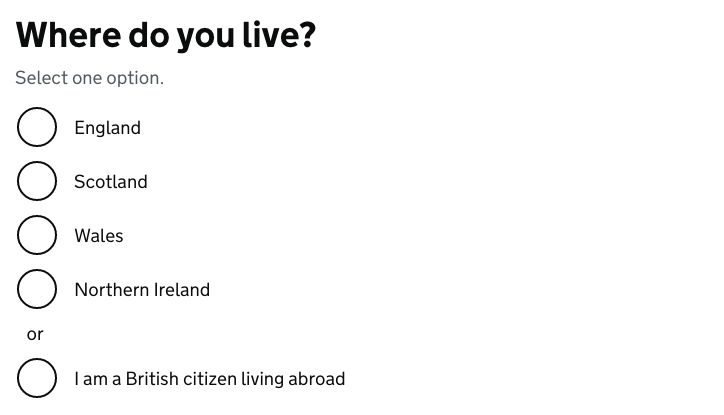
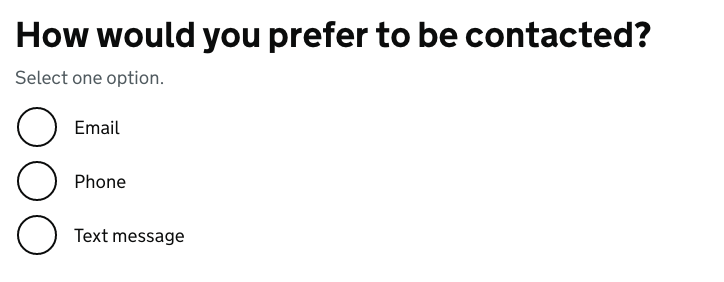

# Radios

[GDS Radios component](https://design-system.service.gov.uk/components/radios/)

## Example

```razor
<govuk-radios name="where-do-you-live">
    <govuk-radios-fieldset>
        <govuk-radios-fieldset-legend is-page-heading="true" class="govuk-fieldset__legend--l">
            Where do you live?
        </govuk-radios-fieldset-legend>

        <govuk-radios-hint>
            Select one option.
        </govuk-radios-hint>

        <govuk-radios-item value="england">England</govuk-radios-item>
        <govuk-radios-item value="scotland">Scotland</govuk-radios-item>
        <govuk-radios-item value="wales">Wales</govuk-radios-item>
        <govuk-radios-item value="northern-ireland">Northern Ireland</govuk-radios-item>
        <govuk-radios-divider>or</govuk-radios-divider>
        <govuk-radios-item value="abroad">I am a British citizen living abroad</govuk-radios-item>
    </govuk-radios-fieldset>
</govuk-radios>
```



## Example - with conditional reveal

```razor
<govuk-radios name="how-contacted" id-prefix="contact">
    <govuk-radios-fieldset>
        <govuk-radios-fieldset-legend is-page-heading="true" class="govuk-fieldset__legend--l">
            How would you prefer to be contacted?
        </govuk-radios-fieldset-legend>

        <govuk-radios-hint>
            Select one option.
        </govuk-radios-hint>

        <govuk-radios-item value="email">
            Email
            <govuk-radios-item-conditional>
                <govuk-input id="contact-by-email" name="contact-by-email" type="email" autocomplete="email" spellcheck="false" class="govuk-!-width-one-half">
                    <govuk-input-label>Email address</govuk-input-label>
                    <govuk-input-error-message>Email address cannot be blank</govuk-input-error-message>
                </govuk-input>
            </govuk-radios-item-conditional>
        </govuk-radios-item>

        <govuk-radios-item value="phone">
            Phone
            <govuk-radios-item-conditional>
                <govuk-input id="contact-by-phone" name="contact-by-phone" type="tel" autocomplete="tel" class="govuk-!-width-one-third">
                    <govuk-input-label>Phone number</govuk-input-label>
                </govuk-input>
            </govuk-radios-item-conditional>
        </govuk-radios-item>

        <govuk-radios-item value="text">
            Text message
            <govuk-radios-item-conditional>
                <govuk-input id="contact-by-text" name="contact-by-text" type="tel" autocomplete="tel" class="govuk-!-width-one-third">
                    <govuk-input-label>Mobile phone number</govuk-input-label>
                </govuk-input>
            </govuk-radios-item-conditional>
        </govuk-radios-item>
    </govuk-radios-fieldset>
</govuk-radios>
```



## Example - with error message

```razor
<govuk-radios name="where-do-you-live">
    <govuk-radios-fieldset>
        <govuk-radios-fieldset-legend is-page-heading="true" class="govuk-fieldset__legend--l">
            Where do you live?
        </govuk-radios-fieldset-legend>

        <govuk-radios-hint>
            Select one option.
        </govuk-radios-hint>

        <govuk-radios-error-message>
            Select the country where you live
        </govuk-radios-error-message>

        <govuk-radios-item value="england">England</govuk-radios-item>
        <govuk-radios-item value="scotland">Scotland</govuk-radios-item>
        <govuk-radios-item value="wales">Wales</govuk-radios-item>
        <govuk-radios-item value="northern-ireland">Northern Ireland</govuk-radios-item>
    </govuk-radios-fieldset>
</govuk-radios>
```


## API

### `<govuk-radios>`

| Attribute | Type | Description |
| --- | --- | --- |
| asp-for | `ModelExpression` | The model expression used to generate the `name` and `id` attributes as well as the `selected` attribute for items and error message content. See [documentation on forms](forms.md) for more information. |
| id-prefix | `string` | The prefix to use when generating IDs for the hint, error message and items. If not specified then a value is generated from the `name` attribute. Required unless the `asp-for` attribute or `name` atribute is specified. |
| ignore-modelstate-errors | `bool` | Whether ModelState errors on the ModelExpression specified by the `asp-for` attribute should be ignored when generating an error message. The default is `false`. |
| name | `string` | The `name` attribute for the generated `input` element. Required unless the `asp-for` attribute or `id-prefix` attribute is specified. |
| radios-* | | Additional attributes to add to the generated container element that wraps the items. |

### `<govuk-radios-fieldset>`

A container element used when radios content should be contained with a `fieldset` element.
When used every `<govuk-radios-hint>`, `<govuk-radios-error-message>`, `<govuk-radios-item>` and `<govuk-radios-divider>` must be placed inside this element, not the root `<govuk-radios>`.\
Must be inside a `<govuk-radios>` element.

### `<govuk-radios-fieldset-legend>`

*Required* when a `<govuk-radios-fieldset>` is specified\
The content is the HTML to use within the legend.\
Must be inside a `<govuk-radios-fieldset>` element.

| Attribute | Type | Description |
| --- | --- | --- |
| `is-page-heading` | `boolean` | Whether the legend also acts as the heading for the page. The default is `false`. |

### `<govuk-radios-hint>`

The content is the HTML to use within the component's hint.\
Must be inside a `<govuk-radios>` or `<govuk-radios-fieldset>` element.

If the `asp-for` attribute is specified on the parent `<govuk-radios>` then content for the hint will be generated from the model expression.\
If you want to retain the generated content and specify additional attributes then use a self-closing tag e.g.
`<govuk-radios-hint class="some-additional-class" />`.

### `<govuk-radios-error-message>`

The content is the HTML to use within the component's error message.\
Must be inside a `<govuk-radios>` or `<govuk-radios-fieldset>` element.

If the `asp-for` attribute is specified on the parent `<govuk-radios>` then content for the error message will be generated from the model expression.
(To prevent this set `ignore-modelstate-errors` on the parent `<govuk-radios>` to `false`.) Specifying any content here will override any generated error message.\
If you want to retain the generated content and specify additional attributes then use a self-closing tag e.g.
`<govuk-radios-error-message visually-hidden-text="Error" />`.

| Attribute | Type | Description |
| --- | --- | --- |
| visually-hidden-text | `string` | The visually hidden prefix used before the error message. The default is `Error`. |

### `<govuk-radios-item>`

The content is the HTML to use within the label for the generated `input` element.\
Must be inside a `<govuk-radios>` or `<govuk-radios-fieldset>` element.

| Attribute | Type | Description |
| --- | --- | --- |
| checked | `bool` | Whether the item should be checked. If this attribute is not specified but the `asp-for` attribute is specified on the parent `<govuk-radios>` then this value will be computed by comparing the `value` attribute with the model value; if the `value` attribute matches the string representation of the model then `checked` will be inferred to `true`. |
| disabled | `bool` | Whether the item should be disabled. The default is `false`. |
| id | `string` | The `id` attribute for the generated `input` element. If not specified then a value is generated from the `name` attribute. |
| input-* | | Additional attributes to add to the generated `input` element. |
| label-* | | Additional attributes to add to the generated `label` element. |
| name | string | The `name` attribute for the generated `input` element. Required unless the `asp-for` attribute or `name` attribute is specified on the parent `<govuk-radios>`. |
| value | `string` | *Required* The `value` attribute for the generated `input` element. |

### `<govuk-radios-item-conditional>`

The content is the HTML to use within the conditional reveal for the item.\
Must be inside a `<govuk-radios-item>`.

### `<govuk-radios-divider>`

The content is the HTML to use within item divider.\
Must be inside a `<govuk-radios>` or `<govuk-radios-fieldset>` element.
