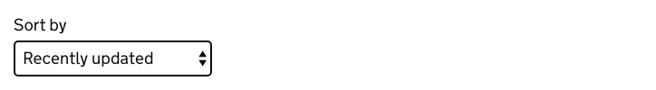

# Select

[GDS Select component](https://design-system.service.gov.uk/components/select/)

## Example

```razor
<govuk-select name="Sort">
    <govuk-select-label>Sort by</govuk-select-label>
    <govuk-select-item value="published">Recently published</govuk-select-item>
    <govuk-select-item value="updated" selected="true">Recently updated</govuk-select-item>
    <govuk-select-item value="views">Most views</govuk-select-item>
    <govuk-select-item value="comments">Most comments</govuk-select-item>
</govuk-select>
```



## API

### `<govuk-select>`

| Attribute | Type | Description |
| --- | --- | --- |
| `asp-for` | `ModelExpression` | The model expression used to generate the `name` and `id` attributes as well as the `selected` attribute for items and error message content. See [documentation on forms](forms.md) for more information. |
| `described-by` | `string` | One or more element IDs to add to the `aria-describedby` attribute of the generated `select` element. |
| `disabled` | `bool` | Whether the element should be disabled. The default is `false`. |
| `id` | `string` | The `id` attribute for the generated `select` element. If not specified then a value is generated from the `name` attribute. |
| `ignore-modelstate-errors` | `bool` | Whether ModelState errors on the ModelExpression specified by the `asp-for` attribute should be ignored when generating an error message. The default is `false`. |
| `name` | `string` | The `name` attribute for the generated `select` element. Required unless the `asp-for` attribute is specified. |
| `select-*` | | Additional attributes to add to the generated `select` element. |

### `<govuk-select-label>`

The content is the HTML to use within the component's label.\
Must be inside a `<govuk-select>` element.

| Attribute | Type | Description |
| --- | --- | --- |
| `is-page-heading` | `bool` | Whether the label also acts as the heading for the page. The default is `false`. |

### `<govuk-select-hint>`

The content is the HTML to use within the component's hint.\
Must be inside a `<govuk-select>` element.

If the `asp-for` attribute is specified on the parent `<govuk-select>` then content for the hint will be generated from the model expression.\
If you want to retain the generated content and specify additional attributes then use a self-closing tag e.g.
`<govuk-select-hint class="some-additional-class" />`.

### `<govuk-select-error-message>`

The content is the HTML to use within the component's error message.\
Must be inside a `<govuk-select>` element.

If the `asp-for` attribute is specified on the parent `<govuk-select>` then content for the error message will be generated from the model expression.
(To prevent this set `ignore-modelstate-errors` on the parent `<govuk-select>` to `false`.) Specifying any content here will override any generated error message.\
If you want to retain the generated content and specify additional attributes then use a self-closing tag e.g.
`<govuk-select-error-message visually-hidden-text="Error" />`.

| Attribute | Type | Description |
| --- | --- | --- |
| `visually-hidden-text` | `string` | The visually hidden prefix used before the error message. The default is `Error`. |

### `<govuk-select-item>`

The content is the HTML to use within the generated `option` element.\
Must be inside a `<govuk-select>` element.

| Attribute | Type | Description |
| --- | --- | --- |
| `disabled` | `bool` | Whether the item should be disabled. The default is `false`. |
| `selected` | `bool` | Whether the item should be selected. If this attribute is not specified but the `asp-for` attribute is specified on the parent then this value will be computed by comparing the `value` attribute with the model value. The default is `false`. |
| `value` | `string` | The `value` attribute for the generated `option` element. |
