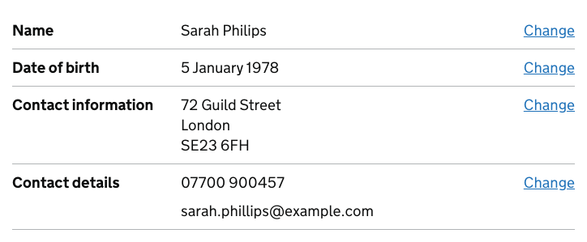
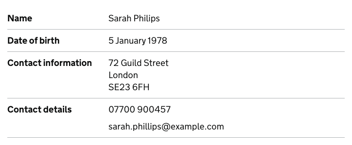
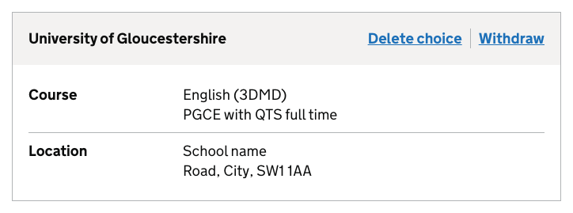

# Summary list

[GDS Summary list component](https://design-system.service.gov.uk/components/summary-list/)

## Example - with actions

```razor
<govuk-summary-list>
    <govuk-summary-list-row>
        <govuk-summary-list-row-key>
            Name
        </govuk-summary-list-row-key>
        <govuk-summary-list-row-value>
            Sarah Philips
        </govuk-summary-list-row-value>
        <govuk-summary-list-row-actions>
            <govuk-summary-list-row-action href="#" visually-hidden-text="name">Change</govuk-summary-list-row-action>
        </govuk-summary-list-row-actions>
    </govuk-summary-list-row>
    <govuk-summary-list-row>
        <govuk-summary-list-row-key>
            Date of birth
        </govuk-summary-list-row-key>
        <govuk-summary-list-row-value>
            5 January 1978
        </govuk-summary-list-row-value>
        <govuk-summary-list-row-actions>
            <govuk-summary-list-row-action href="#" visually-hidden-text="date of birth">Change</govuk-summary-list-row-action>
        </govuk-summary-list-row-actions>
    </govuk-summary-list-row>
    <govuk-summary-list-row>
        <govuk-summary-list-row-key>
            Contact information
        </govuk-summary-list-row-key>
        <govuk-summary-list-row-value>
            72 Guild Street<br>London<br>SE23 6FH
        </govuk-summary-list-row-value>
        <govuk-summary-list-row-actions>
            <govuk-summary-list-row-action href="#" visually-hidden-text="contact information">Change</govuk-summary-list-row-action>
        </govuk-summary-list-row-actions>
    </govuk-summary-list-row>
    <govuk-summary-list-row>
        <govuk-summary-list-row-key>
            Contact details
        </govuk-summary-list-row-key>
        <govuk-summary-list-row-value>
            <p class="govuk-body">07700 900457</p><p class="govuk-body">sarah.phillips@example.com</p>
        </govuk-summary-list-row-value>
        <govuk-summary-list-row-actions>
            <govuk-summary-list-row-action href="#" visually-hidden-text="contact details">Change</govuk-summary-list-row-action>
        </govuk-summary-list-row-actions>
    </govuk-summary-list-row>
</govuk-summary-list>
```



## Example - without actions

```razor
<govuk-summary-list>
    <govuk-summary-list-row>
        <govuk-summary-list-row-key>
            Name
        </govuk-summary-list-row-key>
        <govuk-summary-list-row-value>
            Sarah Philips
        </govuk-summary-list-row-value>
    </govuk-summary-list-row>
    <govuk-summary-list-row>
        <govuk-summary-list-row-key>
            Date of birth
        </govuk-summary-list-row-key>
        <govuk-summary-list-row-value>
            5 January 1978
        </govuk-summary-list-row-value>
    </govuk-summary-list-row>
    <govuk-summary-list-row>
        <govuk-summary-list-row-key>
            Contact information
        </govuk-summary-list-row-key>
        <govuk-summary-list-row-value>
            72 Guild Street<br>London<br>SE23 6FH
        </govuk-summary-list-row-value>
    </govuk-summary-list-row>
    <govuk-summary-list-row>
        <govuk-summary-list-row-key>
            Contact details
        </govuk-summary-list-row-key>
        <govuk-summary-list-row-value>
            <p class="govuk-body">07700 900457</p><p class="govuk-body">sarah.phillips@example.com</p>
        </govuk-summary-list-row-value>
    </govuk-summary-list-row>
</govuk-summary-list>
```



## Example - with card

```razor
<govuk-summary-card>
    <govuk-summary-card-title>University of Gloucestershire</govuk-summary-card-title>
    <govuk-summary-card-actions>
        <govuk-summary-card-action href="#" visually-hidden-text="of University of Gloucestershire">Delete choice</govuk-summary-card-action>
        <govuk-summary-card-action href="#" visually-hidden-text="from University of Gloucestershire">Withdraw</govuk-summary-card-action>
    </govuk-summary-card-actions>
    <govuk-summary-list>
        <govuk-summary-list-row>
            <govuk-summary-list-row-key>Course</govuk-summary-list-row-key>
            <govuk-summary-list-row-value>English (3DMD)<br>PGCE with QTS full time</govuk-summary-list-row-value>
        </govuk-summary-list-row>
        <govuk-summary-list-row>
            <govuk-summary-list-row-key>Location</govuk-summary-list-row-key>
            <govuk-summary-list-row-value>School name<br>Road, City, SW1 1AA</govuk-summary-list-row-value>
        </govuk-summary-list-row>
    </govuk-summary-list>
</govuk-summary-card>
```



## API

### `<govuk-summary-list>`

### `<govuk-summary-list-row>`

Must be inside a `<govuk-summary-list>` element.

### `<govuk-summary-list-row-key>`

*Required*\
The content is the HTML to use within the key for the row.\
Must be inside a `<govuk-summary-list-row>` element.

### `<govuk-summary-list-row-value>`

*Required*\
The content is the HTML to use within the value for the row.\
Must be inside a `<govuk-summary-list-row>` element.

### `<govuk-summary-list-row-actions>`

The container element for the row's actions, if any.\
Must be inside a `<govuk-summary-list-row>` element.

### `<govuk-summary-list-row-action>`

| Attribute              | Type     | Description                                                                                                                            |
|------------------------|----------|----------------------------------------------------------------------------------------------------------------------------------------|
| (link attributes)      |          | If specified generates an `href` attribute using the specified values. See [documentation on links](../links.md) for more information. |
| `visually-hidden-text` | `string` | The visually hidden text for the link.                                                                                                 |

The content is the HTML to use within the generated link.\
Must be inside a `<govuk-summary-list-row-actions>` element.

### `<govuk-summary-card>`

Must contain a `<govuk-summary-list>` as its final child element.

### `<govuk-summary-card-title>`

| Attribute       | Type  | Description                                                                     |
|-----------------|-------|---------------------------------------------------------------------------------|
| `heading-level` | `int` | The heading level. Must be between `1` and `6` (inclusive). The default is `2`. |

The content is the HTML to use for the card's title.\
Must be inside a `<govuk-summary-card>` element.

### `<govuk-summary-card-actions>`

The container element for the card's actions, if any.\
Must be inside a `<govuk-summary-card>` element.

### `<govuk-summary-card-action>`

| Attribute              | Type     | Description                                                                                                                            |
|------------------------|----------|----------------------------------------------------------------------------------------------------------------------------------------|
| (link attributes)      |          | If specified generates an `href` attribute using the specified values. See [documentation on links](../links.md) for more information. |
| `visually-hidden-text` | `string` | The visually hidden text for the link.                                                                                                 |

The content is the HTML to use within the generated link.\
Must be inside a `<govuk-summary-card-actions>` element.
