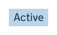
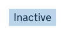

# Tag

[GDS Tag component](https://design-system.service.gov.uk/components/tag/)

## Example

```razor
<govuk-tag>Active</govuk-tag>
```



## Example - with additional class

```razor
<govuk-tag class="govuk-tag--inactive">Inactive</govuk-tag>
```




## API

### `<govuk-tag>`

Content is the inner HTML to use within the generated `<strong>`.

| Attribute | Type | Description |
| --- | --- | --- |
| * | | Any additional attributes will be copied onto the generated `<a>`. |
