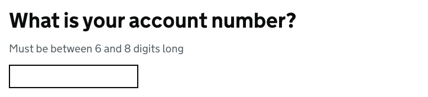
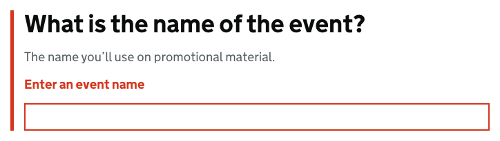
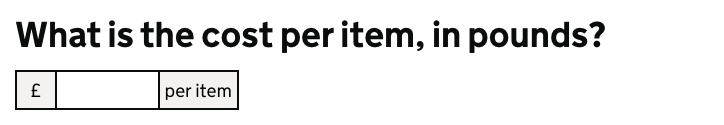

# Text input

[GDS Text input component](https://design-system.service.gov.uk/components/text-input/)

## Example

```razor
<govuk-input name="AccountNumber" input-class="govuk-input--width-10" inputmode="numeric" pattern="[0-9]*" spellcheck="false">
    <govuk-input-label is-page-heading="true" class="govuk-label--l">What is your account number?</govuk-input-label>
    <govuk-input-hint>Must be between 6 and 8 digits long</govuk-input-hint>
</govuk-input>
```



## Example - with error message

```razor
<govuk-input name="EventName">
    <govuk-input-label is-page-heading="true" class="govuk-label--l">What is the name of the event?</govuk-input-label>
    <govuk-input-hint>The name you’ll use on promotional material.</govuk-input-hint>
    <govuk-input-error-message>Enter an event name</govuk-input-error-message>
</govuk-input>
```



## Example - with prefix and suffix

```razor
<govuk-input name="AccountNumber" input-class="govuk-input--width-5" spellcheck="false">
    <govuk-input-label is-page-heading="true" class="govuk-label--l">What is the cost per item, in pounds?</govuk-input-label>
    <govuk-input-prefix>&pound;</govuk-input-prefix>
    <govuk-input-suffix>per item</govuk-input-suffix>
</govuk-input>
```




## API

### `<govuk-input>`

The content is the HTML to use within the generated component.

| Attribute | Type | Description |
| --- | --- | --- |
| `for` | `ModelExpression` | The model expression used to generate the `name`, `id` and `value` attributes as well as the error message content. See [documentation on forms](forms.md) for more information. |
| `autocomplete` | `string` | The `autocomplete` attribute for the generated `input` element. |
| `described-by` | `string` | One or more element IDs to add to the `aria-describedby` attribute of the generated `input` element. |
| `disabled` | `bool` | Whether the input should be disabled. The default is `false`. |
| `id` | `string` | The `id` attribute for the generated `input` element. If not specified then a value is generated from the `name` attribute. |
| `ignore-modelstate-errors` | `bool` | Whether ModelState errors on the ModelExpression specified by the `for` attribute should be ignored when generating an error message. The default is `false`. |
| `input-*` | | Additional attributes to add to the generated `input` element. |
| `label-class` | `string` | Additional classes for the generated `label` element. |
| `name` | `string` | The `name` attribute for the generated `input` element. Required unless the `for` attribute is specified. |
| `inputmode` | `string` | The `inputmode` attribute for the generated `input` element. |
| `pattern` | `string` | The `pattern` attribute for the generated `input` element. |
| `spellcheck` | `bool?` | The `spellcheck` attribute for the generated `input` element. The default is `null`. |
| `type` | `string` | The `type` attribute for the generated `input` element. The default is `text`. |
| `value` | `string` | The `value` attribute for the generated `input` element. |

### `<govuk-input-label>`

The content is the HTML to use within the component's label.\
Must be inside a `<govuk-input>` element.

| Attribute | Type | Description |
| --- | --- | --- |
| `is-page-heading` | `bool` | Whether the label also acts as the heading for the page. The default is `false`. |

### `<govuk-input-hint>`

The content is the HTML to use within the component's hint.\
Must be inside a `<govuk-input>` element.

If the `for` attribute is specified on the parent `<govuk-input>` then content for the hint will be generated from the model expression.\
If you want to retain the generated content and specify additional attributes then use a self-closing tag e.g.
`<govuk-input-hint class="some-additional-class" />`.

### `<govuk-input-error-message>`

The content is the HTML to use within the component's error message.\
Must be inside a `<govuk-input>` element.

If the `for` attribute is specified on the parent `<govuk-input>` then content for the error message will be generated from the model expression.
(To prevent this set `ignore-modelstate-errors` on the parent `<govuk-input>` to `false`.) Specifying any content here will override any generated error message.\
If you want to retain the generated content and specify additional attributes then use a self-closing tag e.g.
`<govuk-input-error-message visually-hidden-text="Error" />`.

| Attribute | Type | Description |
| --- | --- | --- |
| `visually-hidden-text` | `string` | The visually hidden prefix used before the error message. The default is `Error`. |

### `<govuk-input-prefix>`

The content is the HTML to use within the component's prefix.\
Must be inside a `<govuk-input>` element.

### `<govuk-input-suffix>`

The content is the HTML to use within the component's suffix.\
Must be inside a `<govuk-input>` element.
