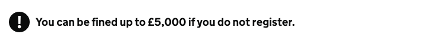

# Details

[GDS Warning text component](https://design-system.service.gov.uk/components/warning-text/)

## Example

```razor
<govuk-warning-text icon-fallback-text="Warning">
    You can be fined up to £5,000 if you do not register.
</govuk-warning-text>
```



## API

### `<govuk-warning-text>`

| Attribute | Type | Description |
| --- | --- | --- |
| `icon-fallback-text` | `string` | The fallback text for the icon. |

The content is the HTML to use within the generated component.
